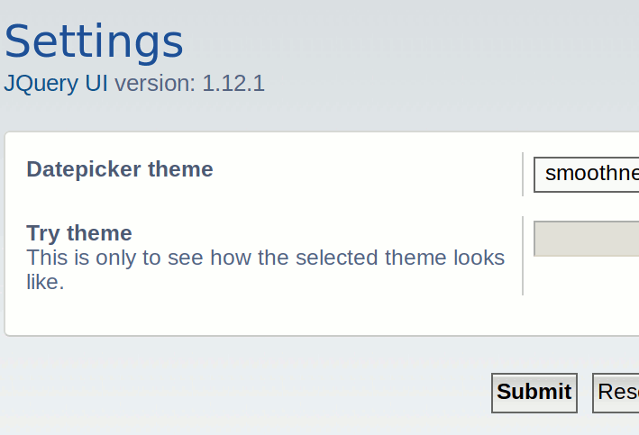

# PhpBB Extension - marttiphpbb JQuery UI Datepicker (helper ext)

[Topic on phpBB.com](https://phpbb.com)

## Requirements

* phpBB 3.2.1+
* PHP 7.1+

## Features

This phpBB extension provides a basic integration of the [JQuery UI Datepicker](http://jqueryui.com/datepicker/) for use ACP by other extensions.

## Screenshot ACP

## Quick Install

You can install this on the latest release of phpBB 3.2 by following the steps below:

* Create `marttiphpbb/jqueryuidatepicker` in the `ext` directory.
* Download and unpack the repository into `ext/marttiphpbb/jqueryuidatepicker`
* Enable `JQuery UI Datepicker (helper ext)` in the ACP at `Customise -> Manage extensions`.

## Uninstall

* Disable `JQuery UI Datepicker (helper ext)` in the ACP at `Customise -> Extension Management -> Extensions`.
* To permanently uninstall, click `Delete Data`. Optionally delete the `/ext/marttiphpbb/jqueryuidatepicker` directory.

## Support

* Report bugs and other issues to the [Issue Tracker](https://github.com/marttiphpbb/phpbb-ext-jqueryuidatepicker/issues).

## For extension developers: how to use

To Do

## License

[GPL-2.0](license.txt)

([JQuery UI](http://jqueryui.com) is licensed under MIT.)
